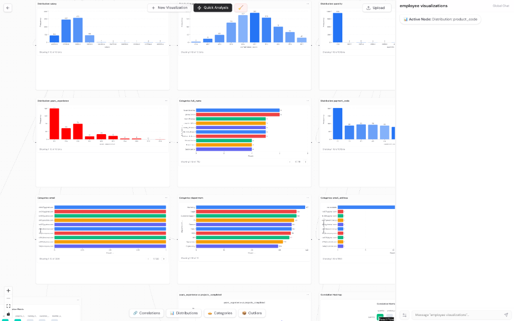
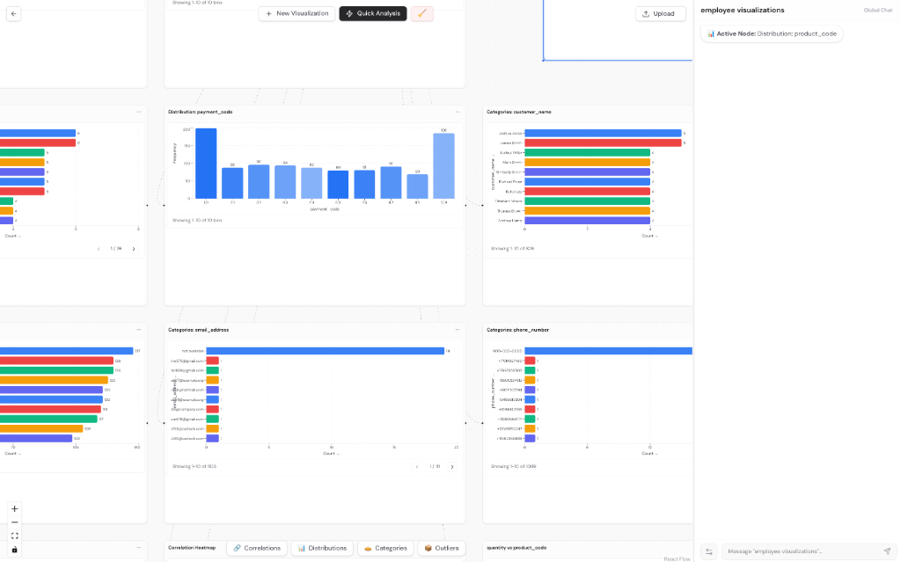

# Dambo

Dambo is an intelligent data visualization and analysis platform powered by the **Tambo SDK** from **tambo.co**. By integrating cutting-edge AI capabilities, Dambo transforms raw CSV datasets into interactive charts and actionable insights. It features a dynamic canvas-based interface where users can create, modify, and explore visualizations through natural language conversations, all driven by the robust **Tambo AI** infrastructure.

<div align="center">
  
  <br/><br/>
  
</div>

## Features

### Key Features

| Feature | Capabilities |
| :--- | :--- |
| **Data Analysis** | • AI-powered profiling & scoring<br>• Missing data & outlier detection<br>• Correlation analysis<br>• ML readiness assessment |
| **Interactive Canvas** | • Drag-and-drop node-based workspace<br>• Multiple charts per dataset<br>• Pan, zoom, organize freely<br>• Export as PNG/JPEG |
| **AI-Powered Chat** | • Natural language modifications<br>• Style customization<br>• Per-node & global chat<br>• Powered by Tambo SDK & Gemini AI |
| **Filtering** | • Natural language filters<br>• Numeric comparisons (>, <, =)<br>• String matching<br>• Persistent filters |

### Chart Types

| Chart Type | Description |
| :--- | :--- |
| **Bar Chart** | Categorical data distribution |
| **Histogram** | Numeric data distribution with customizable bins |
| **Pie Chart** | Proportional breakdown with top N categories |
| **Line Chart** | Time series with optional grouping |
| **Area Chart** | Stacked time series visualization |
| **Scatter Plot** | Two-variable correlation analysis |
| **Box Plot** | Statistical distribution with outlier detection |
| **Correlation Heatmap** | Multi-variable correlation matrix |
| **Stacked Bar Chart** | Grouped categorical comparison |
| **Treemap** | Hierarchical data visualization |


## Tech Stack

| Area | Technologies |
| :--- | :--- |
| **Frontend** | Next.js 16 (App Router), React 19, TypeScript, Tailwind CSS 4, Recharts, XYFlow, Framer Motion, Radix UI, shadcn/ui |
| **Backend** | FastAPI (Python), Tambo SDK, Pandas, NumPy, Google Generative AI, Docker |

## Getting Started

### Prerequisites

| Requirement | Version/Notes |
| :--- | :--- |
| **Node.js** | 18+ (or Bun) |
| **Python** | 3.11+ |
| **Docker** | Docker & Docker Compose |
| **API Key** | Google Gemini API Key |

### Environment Setup

1. Clone the repository:
```bash
git clone https://github.com/kymibuilds/dambo.git
cd dambo
```

2. Create frontend environment file:
```bash
# Create .env.local in the root directory
NEXT_PUBLIC_API_URL=http://localhost:8000
GEMINI_API_KEY=your_gemini_api_key
```

3. Create backend environment file:
```bash
# Create .env in the server directory
GEMINI_API_KEY=your_gemini_api_key
```

### Running the Backend

Using Docker Compose:
```bash
cd server
docker compose up --build
```

The backend API will be available at http://localhost:8000.

### Running the Frontend

Install dependencies:
```bash
bun install
# or
npm install
```

Start the development server:
```bash
bun dev
# or
npm run dev
```

Open http://localhost:3000 in your browser.

## Project Structure

```
dambo/
├── src/
│   ├── app/                    # Next.js App Router pages
│   │   ├── dashboard/[id]/     # Project dashboard with canvas
│   │   └── project/            # Project management
│   ├── components/
│   │   ├── analysis/           # Quick analysis panel components
│   │   ├── canvas/             # Flow canvas and nodes
│   │   ├── charts/             # All chart components
│   │   └── ui/                 # Shared UI components
│   └── lib/
│       ├── api/                # API client functions
│       └── gemini/             # Gemini AI integration
├── server/
│   ├── app/
│   │   ├── routes/             # FastAPI route handlers
│   │   ├── services/           # Business logic
│   │   └── schemas/            # Pydantic models
│   ├── storage/                # Uploaded datasets
│   └── docker-compose.yml
└── public/                     # Static assets
```

## API Endpoints

### Dataset Management
- `POST /datasets/upload` - Upload a CSV file
- `GET /datasets/{id}/profile` - Get dataset profile and statistics
- `GET /datasets/{id}/quick-analysis` - Run AI-powered analysis

### Visualization
- `GET /datasets/{id}/histogram` - Histogram data
- `GET /datasets/{id}/bar` - Bar chart data
- `GET /datasets/{id}/pie` - Pie chart data
- `GET /datasets/{id}/scatter` - Scatter plot data
- `GET /datasets/{id}/line` - Line chart data
- `GET /datasets/{id}/area` - Area chart data
- `GET /datasets/{id}/boxplot` - Box plot statistics
- `GET /datasets/{id}/correlation` - Correlation matrix
- `GET /datasets/{id}/stacked-bar` - Stacked bar data
- `GET /datasets/{id}/treemap` - Treemap data

All visualization endpoints support optional filter parameters:
- `filter_column` - Column to filter on
- `filter_operator` - Comparison operator
- `filter_value` - Value to compare against

## Usage

1. Navigate to the landing page and click to access the dashboard
2. Upload a CSV dataset using the upload panel
3. The AI will automatically analyze your data and suggest visualizations
4. Click on chart suggestions to add them to the canvas
5. Use the chat interface on each node to modify charts:
   - "Show this as a pie chart"
   - "Filter where age is greater than 30"
   - "Change the color to blue"
   - "Show the Department column instead"
6. Drag nodes to organize your workspace
7. Export charts using the menu on each node

## Development

### Building for Production

Frontend:
```bash
bun run build
bun start
```

Backend:
```bash
docker compose -f server/docker-compose.yml up --build
```

### Running Tests

```bash
bun run lint
```


